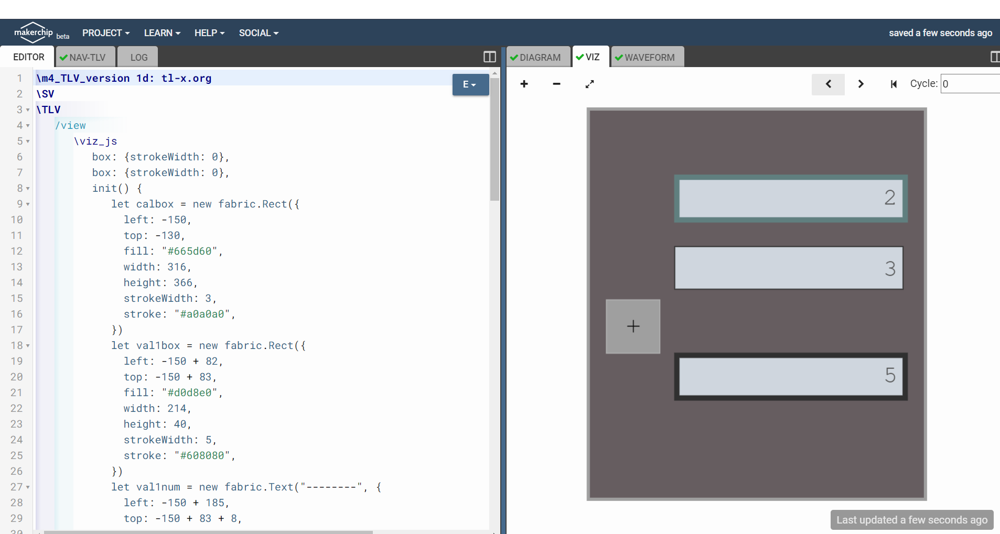

# Using Makerchip's Visual Debug Feature
## Requirements
- [Icarus Verilog](https://iverilog.fandom.com/wiki/Installation_Guide)
- [Makerchip](https://pypi.org/project/makerchip-app/)
  
This is starter project in which I am using the Makerchip's Visual Debug feature with the simulation of a simple circuit whose RTL and testbench has been written in Verilog. The complete code is written in the [adder.v](./adder.v) file. We generated the dump.vcd by performing simulation in iverilog using the following command.

```bash
iverilog adder.v
vvp a.out
```
For using the Mackerchip IDE with the vcd file we use the [viz.tlv](viz.tlv) file which has been created by taking help from the [calculator viz](https://github.com/stevehoover/LF-Building-a-RISC-V-CPU-Core/blob/main/lib/calc_viz.tlv) created by [Steve Hoover](https://github.com/stevehoover). For running Makerchip IDE with the vcd file use the following command.

```bash
makerchip --vcd dump.vcd viz.tlv 
```
For the above command we get the following output.

